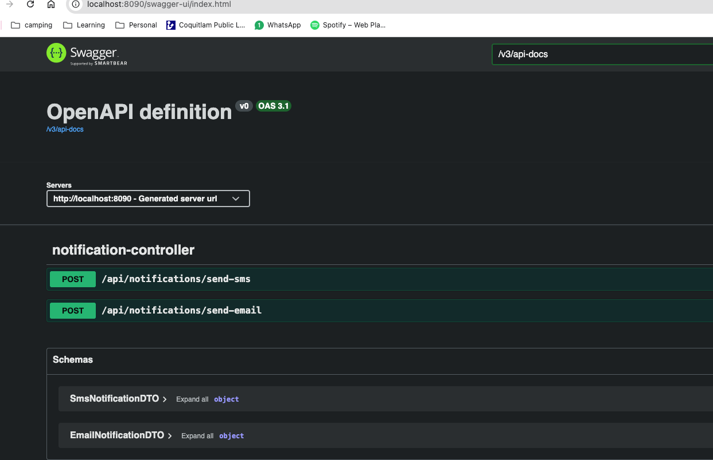

# Notification Service

This is a simple notification service built with Spring Boot. It provides API endpoints to send email and SMS notifications.

## Prerequisites

- Java 21 or later
- Maven
- SMTP server credentials
- Twilio account for SMS
- Lombok plugin for your IDE

## Setup

1. **Clone the repository:**

   ```bash
   git clone <repository-url>
   cd notification-service
   ```

2. **Configure SMTP settings:**

   Update the `src/main/resources/application.properties` file with your SMTP server details:

   ```properties
   spring.mail.host=smtp.example.com
   spring.mail.port=587
   spring.mail.username=your-email@example.com
   spring.mail.password=your-email-password
   spring.mail.properties.mail.smtp.auth=true
   spring.mail.properties.mail.smtp.starttls.enable=true
   ```

3. **Configure Twilio settings:**
   - Create an account: [Twilio Signup](https://login.twilio.com/u/signup)
   - Get the phone number: [Twilio Console](https://console.twilio.com/us1/develop/sms/try-it-out/send-an-sms)
   - Update the `src/main/resources/application.properties` file with your Twilio credentials:

   ```properties
   twilio.account.sid=your_account_sid
   twilio.auth.token=your_auth_token
   twilio.phone.number=your_twilio_phone_number
   ```

4. **Start Kafka:**

   Start Kafka using Docker Compose:

   ```bash
   docker compose up -d
   ```

   List Kafka topics:

   ```bash
   docker exec -it kafka kafka-topics --bootstrap-server localhost:9092 --list
   ```

5. **Build and run the application:**

   Use Maven to build and run the application:

   ```bash
   mvn clean install
   mvn spring-boot:run
   ```

## Usage

Once the application is running, you can send notifications and check the API endpoints:

[Swagger UI](http://localhost:8090/swagger-ui.html)



## How to test using Kafka commands

- Produce one message (manual):

   ```bash
   docker exec -it $(docker ps -qf name=kafka) \
   kafka-console-producer --bootstrap-server localhost:9092 --topic notifications
   ```

   Paste JSON:

   ```json
   {
      "type": "EMAIL",
      "to": "aashicasper@gmail.com",
      "subject": "Kafka test",
      "text": "Hello",
      "correlationId": "c1"
   }
   ```

- To list the messages:

   ```bash
   docker exec -it $(docker ps -qf name=kafka) \
   kafka-console-consumer --bootstrap-server localhost:9092 \
   --topic notifications --from-beginning
   ```

## How to Run the Application

1. **Ensure prerequisites are installed:**
   - Java 21 or later
   - Maven
   - Docker (for Kafka setup)

2. **Clone the repository:**

   ```bash
   git clone <repository-url>
   cd notification-service
   ```

3. **Configure the application:**
   - Update the `src/main/resources/application.properties` file with your SMTP and Twilio credentials as described in the "Setup" section above.

4. **Start Kafka:**
   - Use Docker Compose to start Kafka:

     ```bash
     docker compose up -d
     ```

5. **Build the application:**
   - Run the following Maven command to build the application:

     ```bash
     mvn clean install
     ```

6. **Run the application:**
   - Start the application using the Spring Boot plugin:

     ```bash
     mvn spring-boot:run
     ```

7. **Access the application:**
   - Open your browser and navigate to [http://localhost:8090/swagger-ui.html](http://localhost:8090/swagger-ui.html) to access the Swagger UI and test the API endpoints.
